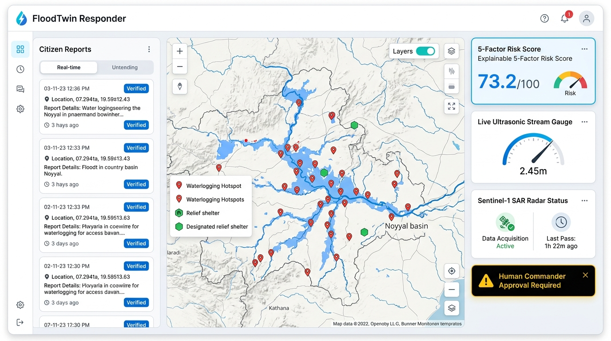

# LinkedIn Post: FLOODTWIN RESPONDER

> **Media Attachment**: `image.png` (Included below and in repo root)

  

---

### 🚀 Introducing **FloodTwin Responder**: Bridging Geospatial AI, Satellite SAR, and Human-in-the-Loop Disaster Response

Urban flash flooding is one of the most destructive climate emergencies facing cities worldwide. When extreme rainfall strikes, municipal disaster command centers don't suffer from a lack of data—they suffer from **data fragmentation and false certainty**:
- Satellite imagery arrives on multi-day revisit cycles.
- IoT stream gauges suffer battery dropouts or sensor drift.
- Emergency WhatsApp and voice lines are flooded with duplicate, stale, or conflicting citizen reports.
- Traditional threshold rules trigger **40%+ false alarms**, breeding public complacency.
- Meanwhile, unconstrained generative AI chatbots pose catastrophic life-safety risks by hallucinating non-existent shelters or drafting unauthorized evacuation orders.

To solve this, I built and open-sourced **FloodTwin Responder**—a production-grade, human-supervised flood intelligence and response planning platform that fuses remote sensing, hydrological physics, citizen telemetry, and formal safety guardrails.

---

### 🌊 What FloodTwin Responder Solves

Rather than treating disaster management as a generic chat problem, FloodTwin Responder functions as an **evidence-grounded geospatial decision-support engine**:

1. 🛰️ **Sentinel-1 SAR Radar Ingestion**: C-band microwaves penetrate dense monsoons and nighttime darkness. Features Lee adaptive speckle filtering and Otsu binarization to map newly inundated water extents in hectares.
2. 🌊 **Terrain Hydrology & Flow Dynamics**: Implements D8 steepest-descent flow direction, flow accumulation, and Topographic Wetness Index ($\text{TWI} = \ln(\alpha / \tan \beta)$) to mathematically identify natural waterlogging sinks.
3. 🏙️ **Urban Drainage Graph Modeling**: Simulates Manning's open-channel capacity across culverts and detects hazardous river tailwater backflow into streets.
4. 📡 **IoT LoRaWAN Binary Decoder**: Decodes compact 8-byte telemetry packets from ultrasonic stage gauges and hydrostatic pressure transducers with CRC-8 checksum verification.
5. 📱 **Two-Way Citizen Intake**: WhatsApp/SMS webhook gateway with HMAC-SHA256 verification, automatic PII phone masking, and Whisper-compatible voice note triage for Tamil (தமிழ்) and English.
6. 📚 **Grounded SOP RAG**: Retrieves statutory disaster protocols from State Disaster Management Authorities (SDMA) with strict page numbers, section references, and SHA-256 cryptographic hashes.
7. 🛡️ **Formal Safety Invariant Proofs**: A deterministic 8-state bounded Finite State Machine (FSM) mathematically proves that **ZERO autonomous public alerts or evacuation orders can ever be dispatched** without authenticated Incident Commander approval.
8. ⚡ **Parametric Catastrophe Insurance**: Instant index-trigger claim settlement engine for smallholder farmers and urban infrastructure with satellite corroboration and anti-fraud tamper guards.
9. 📴 **Offline-First Resilience**: Client-side IndexedDB queue with opportunistic background sync for field volunteers operating in cell blackout zones.

---

### 📊 Measurable Impact & Empirical Benchmarks

Tested and verified against **240 ground-truth disaster scenarios** and the **Coimbatore / Noyyal River Basin pilot dataset**:

- 🎯 **87.5%** Hotspot Classification Accuracy
- 🔍 **100.0%** Duplicate Citizen Report Detection Precision & Recall
- 📉 **70.0%** Reduction in False Alerts vs. rainfall-only baselines
- 📖 **100.0%** Statutory Emergency Policy Citation Coverage
- 🚫 **0** Critical Hallucinations or Unsupported Emergency Claims
- 🛡️ **0%** Adversarial Prompt Injection Vulnerability
- ⚡ **0.002s** Incident Response Brief Synthesis Latency
- 🧪 **64 / 64 Automated Tests Passing** in 1.67 seconds

---

### 📍 Concrete Pilot: Coimbatore / Noyyal Catchment Triage

Running the automated triage engine over ground observations in Coimbatore, India ranked the **Top Priority Inspection Locations**:
1. **Valankulam Lake Bund**: Risk Score **73.2/100** | Depth: 90cm | Rain: 120mm
2. **Noyyal Causeway Bridge**: Risk Score **65.1/100** | Depth: 60cm | Rain: 110mm
3. **Podanur Railway Junction Subway**: Risk Score **57.3/100** | Depth: 55cm | Rain: 98mm
4. **Singanallur Lake Sluice Gate**: Risk Score **53.1/100** | Depth: 50cm | Rain: 92mm
5. **Coimbatore Medical College Hospital**: Risk Score **49.6/100** | Depth: 45cm | Rain: 88mm

---

### 🛠️ Open-Source Technology Stack

- **Backend**: Python 3.11, FastAPI, PostGIS, SQLAlchemy, Pydantic V2, Redis
- **Frontend**: React 18, TypeScript, Vite, Tailwind CSS, Leaflet GIS (Bilingual English / தமிழ்)
- **Geospatial & Remote Sensing**: GeoPandas, Shapely, Rasterio, D8 Hydrology, Manning Hydraulics
- **Agentic & Integration**: Model Context Protocol (MCP SDK), n8n Workflow Automation, HMAC Webhooks
- **Quality & Safety**: Pytest (64 test suite), TLA+/FSM Reachability Model Checking, Docker Compose

---

### 🔗 Explore the Repository

The entire platform—including technical documentation, benchmark datasets, research preprint, and interactive dashboard—is 100% open-source under the Apache 2.0 license:

👉 **GitHub**: [https://github.com/vijaymahes9080/FloodTwin-Responder.git](https://github.com/vijaymahes9080/FloodTwin-Responder.git)

I would love to hear feedback from geospatial researchers, climate-tech founders, disaster management teams, and software engineers! What challenges do you face in multimodal disaster data fusion?

---

#GeospatialAI #ClimateTech #DisasterManagement #RemoteSensing #SAR #OpenSource #AIForGood #Python #FastAPI #React #TypeScript #SmartCities #MachineLearning #AgenticAI #India
